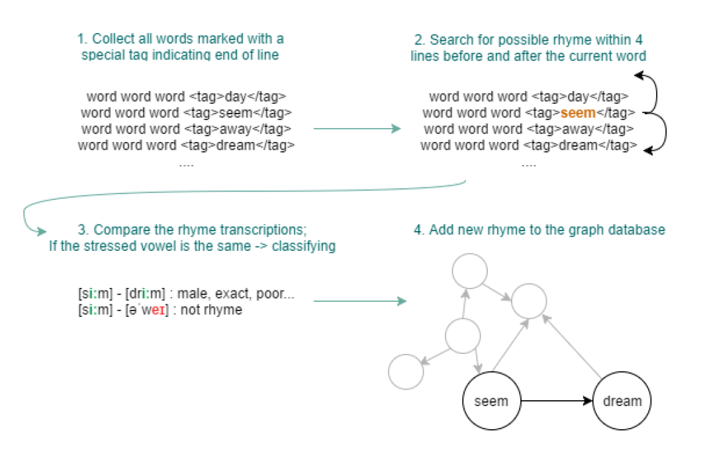
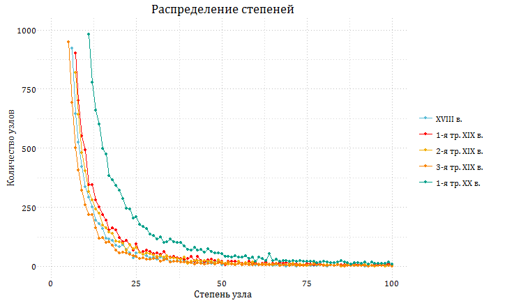

## Граф как метод описания истории русской рифмы

### Об исследовании

Исследование посвящено новому методу анализа русских рифм при помощи метода сетей. Созвучие стихотворных строк может быть удобно описано в терминах теории графов, так как оно представляет связь между словами. Определенные свойства могут быть приписаны узлам или связям, граф можно визуализировать и анализировать с помощью метрик.

Для сетевого анализа рифм мы написали [программу](https://github.com/avonizos/BA_Thesis), которая автоматически находит рифмы в файлах Национального корпуса русского языка, классфицирует их (богатая, точная и т.д.), строит рифменные сети. Усовершенствованную версию программы (без построения сетей) можно найти [тут](https://github.com/avonizos/Russian_rhyme_detector). 

Принцип работы программы:

### Результаты

В результате мы построили 5 сетей по разным временным отрезкам: одну сеть по XVIII веку, по одной сети на каждую треть XIX века, одну сеть по первой трети XX века.  

Основные результаты:

1. Анализ визуализаций показал, что крупнейшие кластеры рифм одинаковы для всех получившихся сетей (пр. закрытые и открытые рифмы с ударным [а]). Крупнейшие узлы также повторяются -- местоимения _он_, _она_, _мой_. При помощи визуализации рифменных сетей мы обнаружили общелингвистические черты русских рифм, независимые от определенной эпохи.

2. Полученные сети характеризуются безмасштабны (scale free), так как степени узлов распределены по степенному закону. Кроме того, наши рифменные не сети не обладают свойством тесного мира (коэффициент кластеризации меньше 0.1). Интересно, что оба этих качества присущи естественно возникающим сетям (биологическим, социальным). Мы предполагаем, что наблюдаемое противоречие говорит о том, что язык рифмы искусственен, подчинен некоторым ограничениям и правилам (метр, ритм и т.д.), однако рифмы создаются на естественном языке.

3. 
