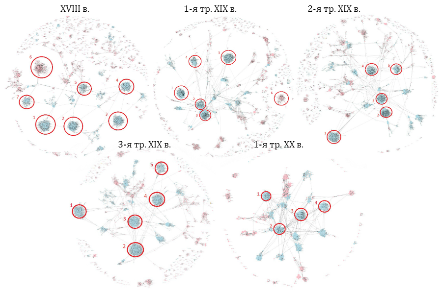
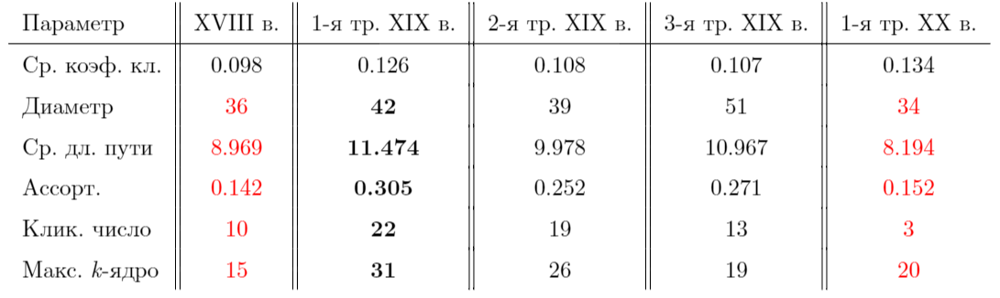

## Граф как метод описания истории русской рифмы

### Об исследовании

Исследование посвящено новому методу анализа русских рифм при помощи сетей. Созвучие стихотворных строк может быть удобно описано в терминах теории графов, так как оно представляет связь между словами. Определенные свойства могут быть приписаны узлам или связям, граф можно визуализировать и анализировать с помощью метрик.

Для сетевого анализа рифм мы написали [программу](https://github.com/avonizos/BA_Thesis), которая автоматически находит рифмы в файлах Национального корпуса русского языка, классифицирует их (богатая, точная и т.д.), строит рифменные сети. Усовершенствованную версию программы (без построения сетей) можно найти [тут](https://github.com/avonizos/Russian_rhyme_detector). 

Принцип работы программы:

  

### Результаты

В результате мы построили 5 сетей по разным временным отрезкам: одну сеть по XVIII веку, по одной сети на каждую треть XIX века, одну сеть по первой трети XX века.  

Основные результаты:

1. Анализ визуализаций показал, что крупнейшие кластеры рифм одинаковы для всех получившихся сетей (пр. закрытые и открытые рифмы с ударным [а]). Крупнейшие узлы также повторяются &mdash; местоимения <i>он</i>, <i>она</i>, <i>мой</i>. При помощи визуализации рифменных сетей мы обнаружили общелингвистические черты русских рифм, независимые от определенной эпохи.

Скриншоты динамических визуализаций всех сетей:
 

  

Примеры динамических визуализаций:

- <a href="http://sozinova.com/dh_hse/18.html" target="_blank">XVIII век: 3469 рифм (131 слово, степень узла >= 100)</a>
  
- <a href="http://sozinova.com/dh_hse/19_1.html" target="_blank">XIX век 1-я треть: 6457 рифм (130 слов, степень узла >= 160)</a>
 
- <a href="http://sozinova.com/dh_hse/19_2.html" target="_blank">XIX век 2-я треть: 6457 рифм (130 слов, степень узла >= 160)</a>
  
- <a href="http://sozinova.com/dh_hse/19_3.html" target="_blank">XIX век 3-я треть: 3944 рифм (136 слов, степень узла >= 100)</a>
  
- <a href="http://sozinova.com/dh_hse/20_1.html" target="_blank">XX век 1-я треть: 12280 рифм (136 слов, степень узла >= 100)</a>
  
<a href="https://github.com/avonizos/BA_Thesis/tree/master/visualization">Оригиналы динамических визуализаций</a>

2. Полученные сети безмасштабны (scale free), так как степени узлов распределены по степенному закону. Кроме того, наши рифменные сети не обладают свойством тесного мира (коэффициент кластеризации меньше 0.1). Интересно, что оба эти качества присущи естественно возникающим сетям (биологическим, социальным). Мы предполагаем, что наблюдаемое противоречие говорит о том, что язык рифмы искусственен, подчинен некоторым ограничениям и правилам (метр, ритм и т.д.), однако рифмы создаются на естественном языке.

  

3. Три графовые метрики (диаметр, средняя длина пути, ассортативность) показали схожие значения для рифменных сетей XVIII века и первой трети XX века. Максимальные значения таких метрик, как средняя длина пути, ассортативность, кликовое число и максимальное <i>k</i>-ядро приходятся на первую треть XIX века. Мы интерпретируем полученные результаты таким образом, что схожие эпохи характеризуются нестабильными рифменными системами &mdash; формирование классицизма в XVIII веке, разрушение традиции в начале XX века. Первая треть XIX века &mdash; наиболее устойчивая система, характеризуемая определенным ядром популярных рифм.

<table>
  <tr>
    <td>Параметр</td>
    <td>XVIII в.</td>
    <td>1-я тр. XIX в.</td>
    <td>2-я тр. XIX в.</td>
    <td>3-я тр. XIX в.</td>
    <td>1-я тр. XX в.</td>
  </tr>
  <tr>
    <td>Ср. коэф. кл.</td>
    <td>0,098</td>
    <td>0,126</td>
    <td>0,108</td>
    <td>0,107</td>
    <td>0,134</td>
  </tr>
  <tr>
    <td>Диаметр</td>
    <td></td>
    <td><b>42</b></td>
    <td>39</td>
    <td>51</td>
    <td style="color:red;">34</td>
  </tr>
  <tr>
    <td>Ср. дл. пути</td>
    <td style="color:red;">8,969</td>
    <td><b>11,474</b></td>
    <td>9,978</td>
    <td>10,967</td>
    <td style="color:red;">8,194</td>
  </tr>
  <tr>
    <td>Ассорт.</td>
    <td style="color:red;">0,142</td>
    <td><b>0,305</b></td>
    <td>0,252</td>
    <td>0,271</td>
    <td style="color:red;">0,152</td>
  </tr>
  <tr>
    <td>Клик. число</td>
    <td style="color:red;">10</td>
    <td><b>22</b></td>
    <td>19</td>
    <td>13</td>
    <td style="color:red;">3</td>
  </tr>
  <tr>
  <td>Макс. <i>k</i>-ядро</td>
    <td style="color:red;">15</td>
    <td><b>31</b></td>
    <td>26</td>
    <td>19</td>
    <td style="color:red;">20</td>
  </tr>
</table>

  

## Ссылки
[Полный текст исследования](https://www.hse.ru/edu/vkr/183946227)

[Краткая информация про распознавание рифм с ё](https://avonizos.github.io/e_vs_yo/)
